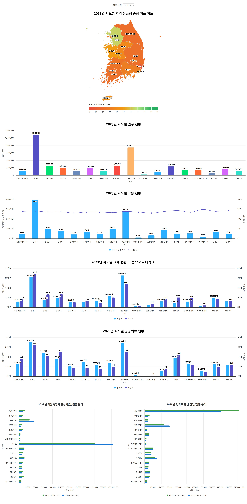

# Region Insight 대시보드

지역 불균형 해소를 위한 대한민국 시도별 종합 데이터 시각화 대시보드



---

## 주요 기능

-   연도별 지역 불균형 종합지표(RDCI) 지도 시각화
-   인구, 고용, 교육, 의료, 인구이동 등 시도별 주요 지표 차트
-   서울/경기도 중심 전입·전출 분석 Bar 차트(한 행에 나란히)
-   모든 데이터 실제 통계 기반, 연도별 선택 가능
-   반응형 UI, 한글화, UX 최적화

## 기술 스택

-   **백엔드**: FastAPI (Python)
-   **프론트엔드**: React (TypeScript), MUI, Highcharts
-   **데이터**: [KOSIS 국가통계포털](https://kosis.kr/index/index.do) 데이터, JSON 변환

## 폴더 구조

```
region-insight/
  backend/app/         # FastAPI 백엔드
  frontend/            # React 프론트엔드
  data/                # 전처리된 통계 데이터(JSON)
  data_raw/            # 원본 엑셀/CSV 등
  docs/                # 설계, API, 데이터 명세 등 문서
```

## 실행 방법

### 1. 백엔드(FastAPI)

```bash
conda activate region-insight
cd backend/app
uvicorn main:app --reload
```

### 2. 프론트엔드(React)

```bash
cd frontend
npm install
npm start
```

## 문서화 위치

-   `/docs/plan.md` : 전체 설계/기획 요약
-   `/docs/project_plan.md` : 프로젝트 전체 계획/로드맵
-   `/docs/detailed_sections.md` : 섹션별 상세 구현/UX
-   `/docs/api-spec.md` : API 명세
-   `/docs/data_fields_desc.md` : 데이터 필드 설명
-   `/docs/label_map.csv` : 시도명/필드명 등 매핑 테이블
